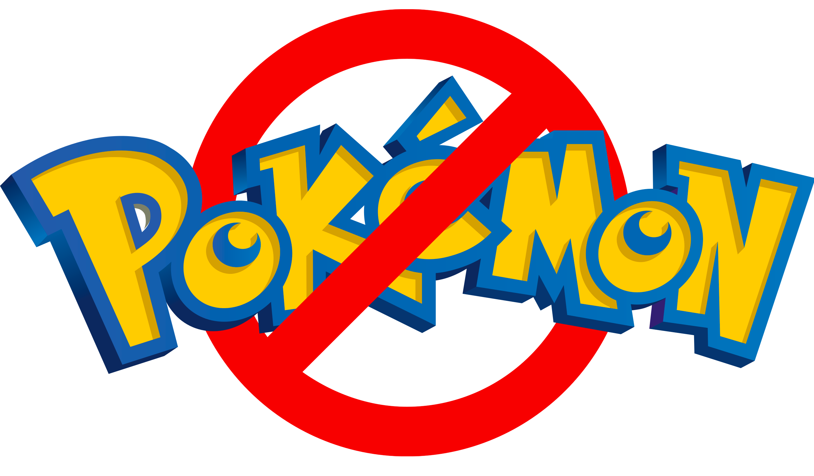

<h1 align="center">
  
  <br><br>
  NOT Pokémon
</h1>

<br>
<h4 align="center">Projeto para criação de um jogo inspirado em Pokémon</h4>
<br>

<p align="center">
  <a href="https://img.shields.io/github/repo-size/iflickerz/not-pokemon?color=FF0072&label=Tamanho%20do%20Repo&logo=databricks&logoColor=white&style=for-the-badge">
    
  </a>
  <a href="https://img.shields.io/github/issues/iflickerz/not-pokemon?color=00CEA5&logo=git&logoColor=white&style=for-the-badge">
    
  </a>
  <a href="https://twitter.com/intent/follow?screen_name=Nicman_">
    
  </a>
  <a href="https://github.com/IFlickerz">
    
  </a>
</p>

<br>

## 📋 To-do
<br>

O projeto ainda está em desenvolvimento e as próximas atualizações serão voltadas nas seguintes tarefas:

<br>

### Criação do Mapa com Tiled Map Editor:
* [ ] Downloads e Setup
  * [ ] Obter os assets
  * [ ] Download do Tiled
  * [ ] Importar para o projeto
* [ ] Contrução da base para a terra e os mares
* [ ] Criação das árvores e plantas
* [ ] Detalhamento do cenário
* [ ] Colisões e Limites do mapa
* [ ] Criação das camadas de Foreground
* [ ] Exportar as camadas para o projeto
<br><br>

### Jogador e Desenvolvimento do Mapa:
* [ ] Setup do projeto
* [ ] Importação e Renderização do mapa
* [ ] Criação do Personagem
* [ ] Movimentação do jogador
* [ ] Colisões Player-To-Map-Boundary
* [ ] Criação de Objetos em Foreground
* [ ] Animações de movimento do jogador
<br><br>

### Batalhas
* [ ] Ativação da Batalha
* [ ] Criação do Cenário de batalha
* [ ] Transição do mapa para o cenário de batalha
* [ ] Finalização da batalha adicionando os sprites

<br><br>

## ☕ Como jogar NOT Pokémon
<br>

Para jogar o NOT Pokémon, siga as seguintes etapas:

```
Literalmente baixa e roda (ainda vou fazer isso aqui...)
```


<br><br>

## 📫 Contribuindo para o NOT Pokémon
<br>
Se você quiser contribuir com o NOT Pokémon, siga estas etapas:

1. Bifurque este repositório.
2. Crie um branch: `git checkout -b <nome_branch>`.
3. Faça suas alterações e confirme-as: `git commit -m '<mensagem_commit>'`
4. Envie para o branch original: `git push origin not-pokemon / <local>`
5. Crie a solicitação de pull.

Como alternativa, consulte a documentação do GitHub em [como criar uma solicitação pull](https://help.github.com/en/github/collaborating-with-issues-and-pull-requests/creating-a-pull-request).

<br><br>

## 🤝 Colaboradores

<br>
<table>
  <tr>
    <td align="center">
      <a href="https://github.com/IFlickerz">
        <br>
        <sub>
          <b>Nicolas Mossmann</b>
        </sub>
      </a>
    </td>
  </tr>
</table>

<br>

[⬆ Voltar ao topo](#not-pokemon)<br>
